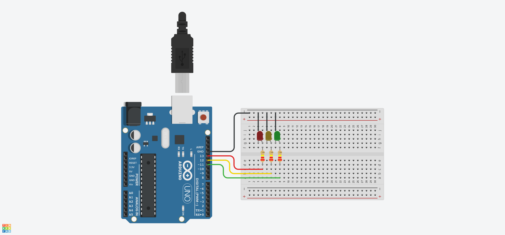

# Projeto Arduíno para manipular um semáforo com 3 leds

## Contextualização

Neste experimento fiz com que o arduino manipulasse 3 leds em determinada ordem.

## Lista de componentes:

- Arduíno UNO R3
- Um cabo de conexão USB
- Placa de prototipação (Protoboard)
- LED
- Resistor de 220 Ω ohms
- Jumpers (macho-macho)

## Esquema do projeto

## Projeto no Tinkercad

https://www.tinkercad.com/things/apmUdMGTFkW
